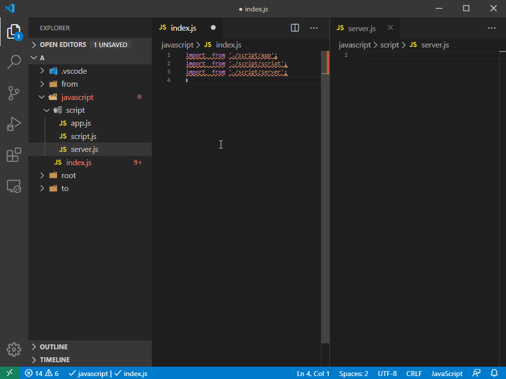
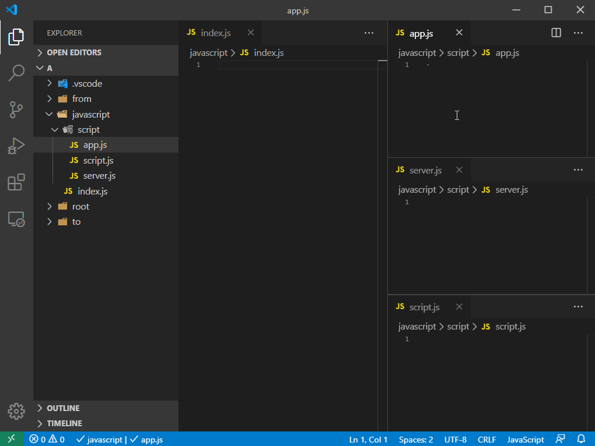
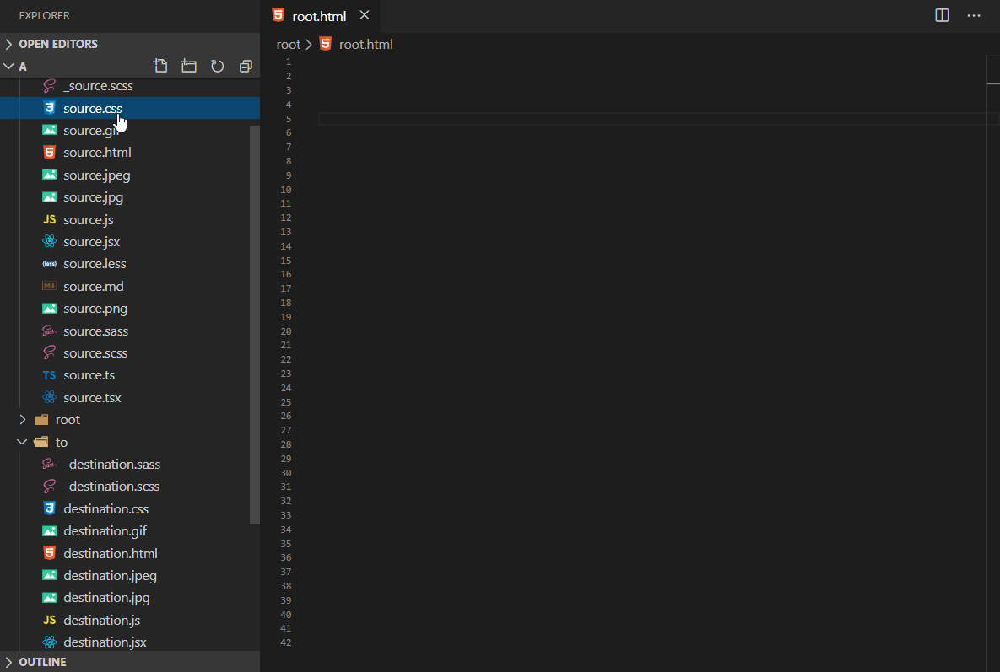
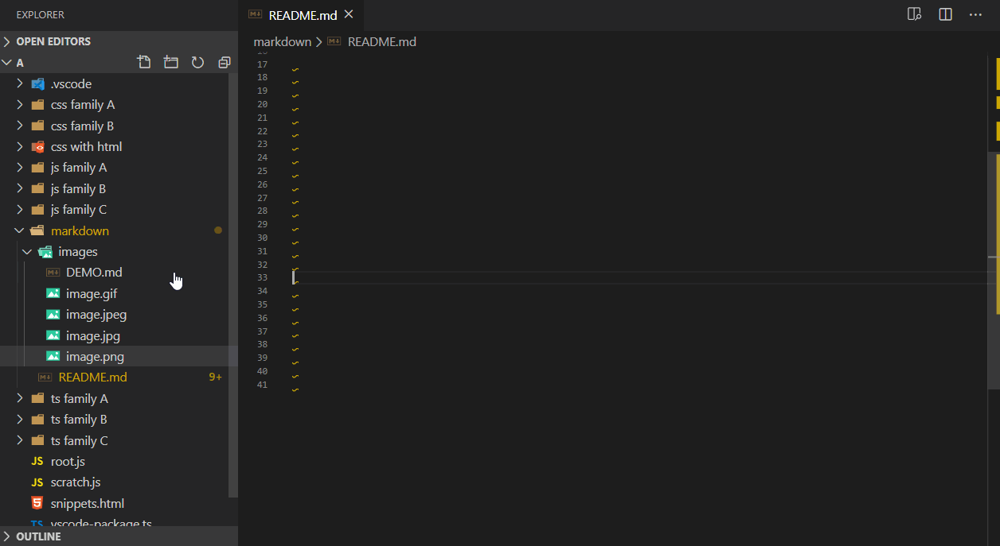
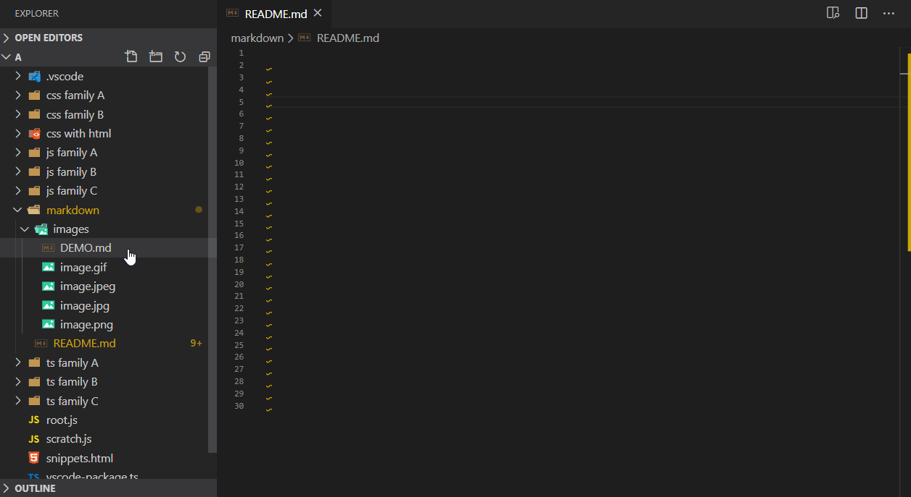

# Auto Import Relative Path (DEMO)

Auto import relative path [extension] for [VS Code]. Auto import relative path without typing long and tedious import statements and file paths.

[VS Code]: https://code.visualstudio.com/
[extension]: https://marketplace.visualstudio.com/VSCode

*This extension is my alternative solution of drag and drop import that is currently not available in VS Code.*

> Drag and drop to import files in JS! [#61667][0]   
> Allow to add file reference with drag and drop. [#5240][1]

[0]: https://github.com/microsoft/vscode/issues/61667
[1]: https://github.com/microsoft/vscode/issues/5240

## Commands

| Command              | Key Binding    | Description                                                                          |
| -------------------- | -------------- | ------------------------------------------------------------------------------------ |
| `Auto Import: Copy`  | `Ctrl+Shift+A` | Copy relative path of selected file in explorer.                                     |
| `Auto Import: Paste` | `Ctrl+I`       | Paste import statement on selected tab.                                              |
| `Auto Import: Auto`  | `Alt+D`        | Auto copy and paste import statement of a file from explorer to selected tab.        |

## Contents

* [Position](#Position)
* [Keybindings](#Keybindings)
* [HTML Support](#HTML-Support)
* [Markdown Support](#Markdown-Support)

## Demo

* (Position) → [Import to cursor](#Import-to-cursor)
* (Position) → [Import to bottom](#Import-to-bottom)
* (Position) → [Import to top](#Import-to-top)
* (Keybindings) → [Auto import from Explorer](#auto-import-from-explorer)
* (Keybindings) → [Single keybinding import](#single-keybinding-import)
* (Keybindings) → [Auto import across active tabs](#auto-import-across-active-tabs)
* (HTML Support) → [Import script and stylesheet](#Import-script-and-stylesheet)
* (Markdown Support) → [Import image to markdown](#Import-image-to-markdown)
* (Markdown Support) → [Import markdown](#Import-markdown)

## Position

### Import to cursor

1. `Ctrl+Shift+A` a file in explorer → `Ctrl+I` in your editor tab.
2. or `Alt+D` a file in explorer to automatically import in editor tab.

### Import to bottom

1. `Ctrl+Shift+A` a file in explorer → `Ctrl+I` in your editor tab.
2. or `Alt+D` a file in explorer to automatically import in editor tab.

### Import to top

1. `Ctrl+Shift+A` a file in explorer → `Ctrl+I` in your editor tab.
2. or `Alt+D` a file in explorer to automatically import in editor tab.

## Keybindings

### Auto import from Explorer

1. `Ctrl+Shift+A` a file in explorer → `Ctrl+I` in your editor tab.

### Single keybinding import

1. `Alt+D` a file in explorer to automatically import in editor tab.

### Auto import across active tabs

1. `Ctrl+Shift+A` a file in explorer → `Ctrl+I` in your editor tab.

## HTML Support

### Import script and stylesheet

1. `Ctrl+Shift+A` a file in explorer → `Ctrl+I` in your editor tab.
2. or `Alt+D` a file in explorer to automatically import in editor tab.

## Markdown Support

### Import image to markdown

1. `Ctrl+Shift+A` a file in explorer → `Ctrl+I` in your editor tab.
2. or `Alt+D` a file in explorer to automatically import in editor tab.

### Import markdown

1. `Ctrl+Shift+A` a file in explorer → `Ctrl+I` in your editor tab.
2. or `Alt+D` a file in explorer to automatically import in editor tab.

## Changelog

See [CHANGELOG] for more information.

[CHANGELOG]: https://github.com/ElecTreeFrying/auto-import-relative-path/blob/master/CHANGELOG.md

## Contributing

* File bugs, or any feature requests in [GitHub Issues].
* Leave a review on [Visual Studio Marketplace].

[Github Issues]: https://github.com/ElecTreeFrying/auto-import-relative-path/issues
[Visual Studio Marketplace]: https://marketplace.visualstudio.com/items?itemName=ElecTreeFrying.auto-import&ssr=false#review-details

## Related

[More extensions of mine.]

[More extensions of mine.]: https://marketplace.visualstudio.com/publishers/ElecTreeFrying
