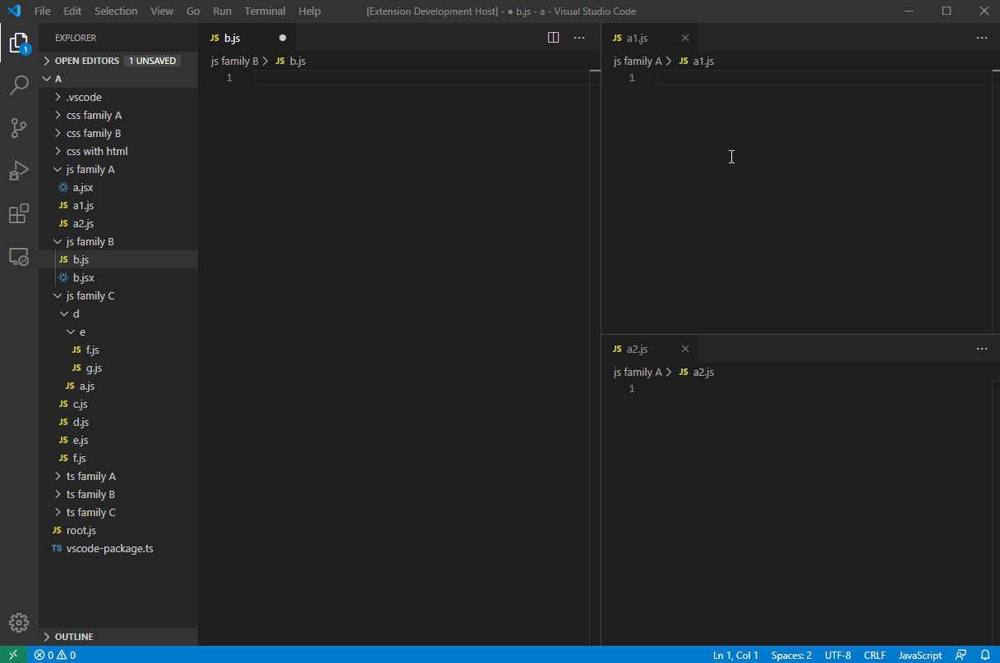

# Auto Import Relative Path (vscode extension)

[![Current version of Auto Import Relative Path][version svg]][package] [![Current installs of Auto Import Relative Path][installs svg]][package] [![Current downloads of Auto Import Relative Path][downloads svg]][package] [![Current ratings of Auto Import Relative Path][ratings svg]][package]

[version svg]: https://vsmarketplacebadges.dev/version-short/electreefrying.auto-import.png
[installs svg]: https://vsmarketplacebadges.dev/installs/electreefrying.auto-import.png
[downloads svg]: https://vsmarketplacebadges.dev/downloads/electreefrying.auto-import.png
[ratings svg]: https://vsmarketplacebadges.dev/rating-short/ElecTreeFrying.auto-import.png
[package]: https://marketplace.visualstudio.com/items?itemName=ElecTreeFrying.auto-import

Auto Import Relative Path, is an [extension] for [VS Code] that makes importing relative paths much easier and less tedious. With this extension, you can say goodbye to long and complicated import statements and file paths. It provides a simple and efficient way to import files without having to manually type out the entire path. Whether you're working on a small project or a large one with many files, this extension can save you a lot of time and effort

[VS Code]: https://code.visualstudio.com/
[extension]: https://marketplace.visualstudio.com/VSCode

## Supported file extensions

|                      | File extension               |
| -------------------- | ---------------------------- |
| Programming Language | `.js`, `.jsx`, `.ts`, `.tsx` |
| Markup Language      | `.html`, `.md`               |
| Stylesheet           | `.css`, `.scss`              |

## Usage

1. Press `Ctrl+Shift+A` on a file in Explorer, then press `Ctrl+I` in your active text editor to import it. → [*Click here to see it in action.*][usagedemo1]
2. Alternatively, press `Alt+D` to automatically import the file in your active text editor. → [*Click here to see it in action.*][usagedemo2]

### [Click here for more usage examples.]

[usagedemo1]: https://github.com/ElecTreeFrying/auto-import-relative-path/blob/master/DEMO.md#auto-import-from-explorer
[usagedemo2]: https://github.com/ElecTreeFrying/auto-import-relative-path/blob/master/DEMO.md#single-keybinding-import

[Click here for more usage examples.]: https://github.com/ElecTreeFrying/auto-import-relative-path/blob/master/DEMO.md

| Active text editor | Supported file extensions                                                                                                                                                 |      More examples       |
| :----------------: | :------------------------------------------------------------------------------------------------------------------------------------------------------------------------ | :----------------------: |
|      `.html`       | `.js`, `.css`, `.gif`, `.jpeg`, `.jpg`, `.png`, .`webp`                                                                                                                   | [click here][usagedemo3] |
|       `.md`        | self, `.gif`, `.jpeg`, `.jpg`, `.png`, .`webp`                                                                                                                            | [click here][usagedemo4] |
|    `.js`, `.ts`    | self                                                                                                                                                                      |                          |
|       `.jsx`       | self, `.js`, `.json` `.css`,`.sass` `.scss` `.png`, `.jpg`, `.gif`, `.svg`, `.webp` `.woff`, `.woff2`, `.ttf`, `.eot` `.md`, `.yml`, `.yaml`, `.html`         |                          |
|       `.tsx`       | self, `.ts`, `.js`, `.json` `.css`, `.sass` `.scss` `.png`, `.jpg`, `.gif`, `.svg`, `.webp` `.woff`, `.woff2`, `.ttf`, `.eot` `.md`, `.yml`, `.yaml`, `.html` |                          |
|       `.css`       | self, `.gif`, `.jpeg`, `.jpg`, `.png`, .`webp`                                                                                                                            |                          |
|      `.scss`       | self,  `.css`, `.gif`, `.jpeg`, `.jpg`, `.png`, .`webp`                                                                                                                   |                          |

[usagedemo3]: https://github.com/ElecTreeFrying/auto-import-relative-path/blob/master/DEMO.md#html-support
[usagedemo4]: https://github.com/ElecTreeFrying/auto-import-relative-path/blob/master/DEMO.md#markdown-support

## Commands

| Command              | Key Binding    | Description                                                                                      |        See in action        |
| -------------------- | -------------- | ------------------------------------------------------------------------------------------------ | :-------------------------: |
| `Auto Import: Copy`  | `Ctrl+Shift+A` | **Copy** the relative path of the selected file in Explorer.                                     | [click here][commandsdemo1] |
| `Auto Import: Paste` | `Ctrl+I`       | **Paste** the import statement into your active text editor.                                     | [click here][commandsdemo1] |
| `Auto Import: Auto`  | `Alt+D`        | **Auto** copy and paste the import statement of a file from Explorer to your active text editor. | [click here][commandsdemo2] |

[commandsdemo1]: https://github.com/ElecTreeFrying/auto-import-relative-path/blob/master/DEMO.md#auto-import-from-explorer
[commandsdemo2]: https://github.com/ElecTreeFrying/auto-import-relative-path/blob/master/DEMO.md#single-keybinding-import

## Configuration Settings

### General settings

* `preferences.disableNotifications`: Disable all notifications.
* `preferences.importStatementPlacement`: Choose where you want your import statements to be placed in your code with this setting. 
  You can choose to place them at the 'top' of the import list, at the 'bottom', or on the current position of the mouse cursor with the 'Cursor' option.

### Import statements

**Scripts:** Javascript, React Javascript, Typescript, React Typescript

* `importStatements.script.preserveFileExtension`: _(Boolean)_ **default → false**
  
* `importStatements.script.javascriptImportStyle`
  * `import $1 from '_relativePath_';` **→ default**
  * `import { $1 } from '_relativePath_';`
  * `import { $1 as $2 } from '_relativePath_';`
  * `import * as $1 from '_relativePath_';`
  * `import '_relativePath_';`
  * `var $1 = require('_relativePath_');`
  * `const $1 = require('_relativePath_');`
  * `var $1 = import('_relativePath_');`
  * `const $1 = import('_relativePath_');`

* `importStatements.script.typescriptImportStyle`
  * `import $1 from '_relativePath_';`
  * `import { $1 } from '_relativePath_';` **→ default**
  * `import { $1 as $2 } from '_relativePath_';`
  * `import * as $1 from '_relativePath_';`
  * `import '_relativePath_';`

**Stylesheets:** CSS, SCSS

* `importStatements.styleSheet.preserveFileExtension`: _(Boolean)_ **default → false**

* `importStatements.styleSheet.cssImportStyle`
  * `@import '_relativePath_';` **→ default**
  * `@import url('_relativePath_');`

* `importStatements.styleSheet.cssImageImportStyle`
  * `url('_relativePath_')` **→ default**

* `importStatements.styleSheet.scssImportStyle`
  * `@import '_relativePath_';` **→ default**
  * `@import url('_relativePath_');`
  * `@use '_relativePath_';`
  * `@use '_relativePath_' as *;`

* `importStatements.styleSheet.scssImageImportStyle`
  * `url('_relativePath_')';` **→ default**

**Markup:** HTML, Markdown

* `importStatements.markup.htmlScriptImportStyle`
  * `` **→ default**

* `importStatements.markup.htmlImageImportStyle`
  * `` **→ default**

* `importStatements.markup.htmlStyleSheetImportStyle`
  * `<link href="_relativePath_" rel="stylesheet">` **→ default**

* `importStatements.markup.markdownImportStyle`
  * `` **→ default**

* `importStatements.markup.markdownImageImportStyle`
  * `` **→ default**
  * `![alt-text][image] / [image]: _relativePath_ "Hover text"`

## Installation

  1. Install VS Code v1.76.0 or higher
  2. Launch Visual Studio Code
  3. Enter command `Ctrl+Shift+P` (Windows, Linux) or `Cmd+Shift+P` (OSX)
  4. Select → `Extensions: Install Extensions`.
  5. Choose **Auto Import Relative Path** by _ElecTreeFrying_
  6. Reload Visual Studio Code

## Changelog

See [CHANGELOG] for more information.

[CHANGELOG]: https://github.com/ElecTreeFrying/auto-import-relative-path/blob/master/CHANGELOG.md

## Contributing

* File bugs, or any feature requests in [GitHub Issues].
* Leave a review on [Visual Studio Marketplace].

[Github Issues]: https://github.com/ElecTreeFrying/auto-import-relative-path/issues
[Visual Studio Marketplace]: https://marketplace.visualstudio.com/items?itemName=ElecTreeFrying.auto-import&ssr=false#review-details

## Related

### More extensions of mine

* [VSCode Text editor]
* [Atom Text editor]

[VSCode Text editor]: https://marketplace.visualstudio.com/publishers/ElecTreeFrying
[Atom Text editor]: https://atom.io/users/ElecTreeFrying

## License

[MIT]

[MIT]: https://marketplace.visualstudio.com/items/ElecTreeFrying.auto-import/license
