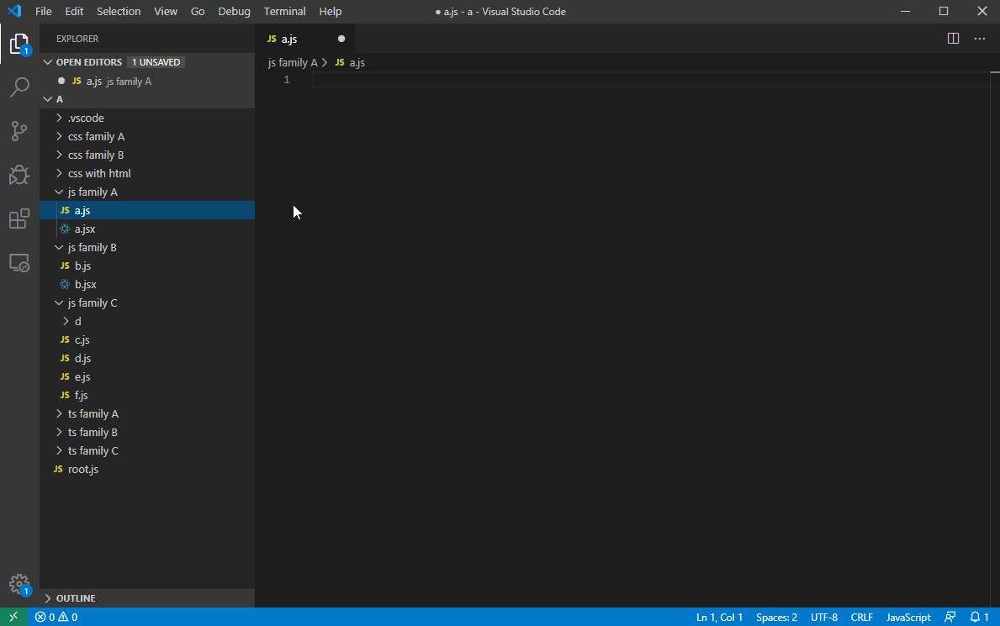
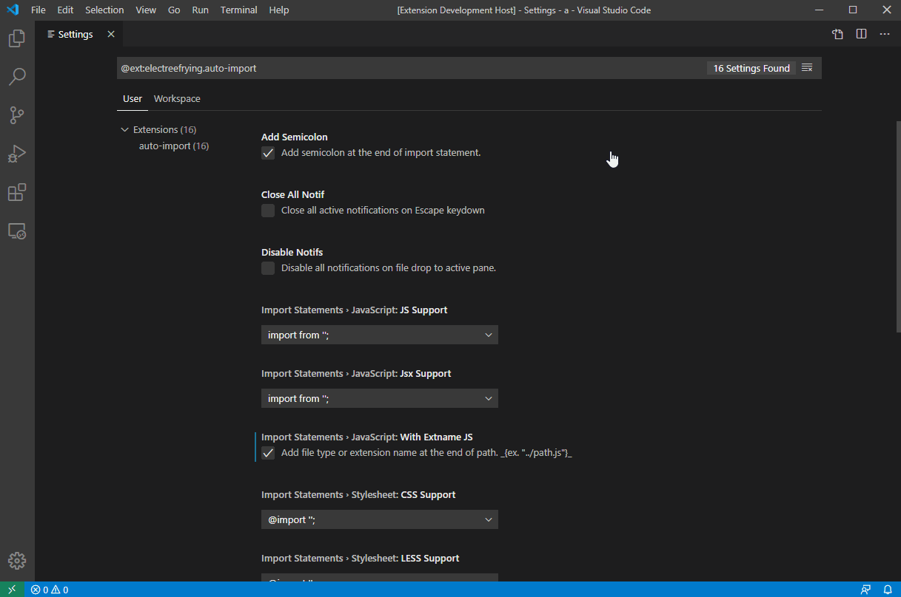

# Auto Import Relative Path (vscode extension)

[![Current version of Auto Import Relative Path][version svg]][package] [![Current installs of Auto Import Relative Path][installs svg]][package] [![Current downloads of Auto Import Relative Path][downloads svg]][package] [![Current ratings of Auto Import Relative Path][ratings svg]][package]

[version svg]: https://vsmarketplacebadges.dev/version-short/electreefrying.auto-import.png
[installs svg]: https://vsmarketplacebadges.dev/installs/electreefrying.auto-import.png
[downloads svg]: https://vsmarketplacebadges.dev/downloads/electreefrying.auto-import.png
[ratings svg]: https://vsmarketplacebadges.dev/rating-short/ElecTreeFrying.auto-import.png
[package]: https://marketplace.visualstudio.com/items?itemName=ElecTreeFrying.auto-import

Auto import relative path [extension] for [VS Code]. Auto import relative path without typing long and tedious import statements and file paths.

[VS Code]: https://code.visualstudio.com/
[extension]: https://marketplace.visualstudio.com/VSCode

*This extension is an alternative solution of drag and drop import that is currently not available in VS Code.*

> Drag and drop to import files in JS! [#61667][0]   
> Allow to add file reference with drag and drop. [#5240][1]

[0]: https://github.com/microsoft/vscode/issues/61667
[1]: https://github.com/microsoft/vscode/issues/5240

## [Drag And Drop Import Relative Path Extension (click here)]

[Drag And Drop Import Relative Path Extension (click here)]: https://marketplace.visualstudio.com/items?itemName=ElecTreeFrying.drag-import-relative-path

## Features

* [Configure import styles](#import-statements--javascript)
* [Usage](#usage)
* [Import to cursor](#Import-to-cursor)
* [Import to bottom](#Import-to-bottom)
* [Import to top](#Import-to-top)
* _[Keybindings]_
* _[HTML Support]_
* _[Markdown Support]_

[Keybindings]: https://github.com/ElecTreeFrying/auto-import-relative-path/blob/master/DEMO.md#keybindings
[HTML Support]: https://github.com/ElecTreeFrying/auto-import-relative-path/blob/master/DEMO.md#html-support
[Markdown Support]: https://github.com/ElecTreeFrying/auto-import-relative-path/blob/master/DEMO.md#markdown-support

## Supported file types

| Markup Language | Programming Language |  Stylesheet  |
| :-------------: | :------------------: | :----------: |
|      .html      | .js, .jsx, .ts, .tsx |     .css     |
|       .md       |                      | .scss, .sass |
|                 |                      |    .less     |

## Usage

1. `Ctrl+Shift+A` a file in explorer → `Ctrl+I` in your editor tab. [demo][usage-example-1]
2. or `Alt+D` a file in explorer to automatically import in editor tab. [demo][usage-example-2]

### [Click here for more usage examples.]

[usage-example-1]: https://github.com/ElecTreeFrying/auto-import-relative-path/blob/master/DEMO.md#auto-import-from-explorer
[usage-example-2]: https://github.com/ElecTreeFrying/auto-import-relative-path/blob/master/DEMO.md#single-keybinding-import

[Click here for more usage examples.]: https://github.com/ElecTreeFrying/auto-import-relative-path/blob/master/DEMO.md

## Commands

| Command              | Key Binding    | Description                                                                       |
| -------------------- | -------------- | --------------------------------------------------------------------------------- |
| `Auto Import: Copy`  | `Ctrl+Shift+A` | **Copy** relative path of selected file in explorer.                              |
| `Auto Import: Paste` | `Ctrl+I`       | **Paste** import statement on selected tab.                                       |
| `Auto Import: Auto`  | `Alt+D`        | **Auto** copy and paste import statement of a file from explorer to selected tab. |

## Valid Imports

|      Import destination      | Valid filetypes                           | References    |
| :--------------------------: | :---------------------------------------- | :------------ |
|           `.html`            | `.js`, `.css`, supported image file types | [(demo)][demo1] |
|            `.md`             | supported image file types                | [(demo)][demo2] |
| `.js`, `.jsx`, `.ts`, `.tsx` | filetype itself                           | [(demo)][demo3] |
|            `.css`            | filetype itself                           | [(demo)][demo3] |
|  `.scss`, `.sass`, `.less`   | `.css`, filetype itself                   | [(demo)][demo3] |

[demo1]: https://github.com/ElecTreeFrying/auto-import-relative-path/blob/master/DEMO.md#html-support
[demo2]: https://github.com/ElecTreeFrying/auto-import-relative-path/blob/master/DEMO.md#markdown-support
[demo3]: https://github.com/ElecTreeFrying/auto-import-relative-path/blob/master/DEMO.md

## Configuration Settings

### General settings

* `quoteStyle`: Select quote style for relative import path. *(double/single quote)*
* `importType`: Paste import on selected line, at the top or bottom of the import list.
* `addSemicolon`: Toggle include semicolon at the end of import statement.
* `disableNotifications`: Disable all notifications.

### Import statements > Javascript

* `importStatements.javascript.jsSupport`: Select **.js** import style.
* `importStatements.javascript.jsxSupport`: Select **.jsx** import style.
* `importStatements.javascript.withExtnameJS`: Include file type at the end of relative import path.

### Import statements > Typescript

* `importStatements.typescript.tsSupport`: Select **.ts** import style.
* `importStatements.typescript.tsxSupport`: Select **.tsx** import style.
* `importStatements.typescript.withExtnameTS`: Include file type at the end of relative import path.
* `importStatements.typescript.addExportName`: Toggle component name in import statement. **(Angular feature)**

### Import statements > Stylesheet

* `importStatements.stylesheet.cssSupport`: Select **.css** import style.
* `importStatements.stylesheet.scssSupport`: Select **.scss** import style.
* `importStatements.stylesheet.lessSupport`: Select **.less** import style.
* `importStatements.stylesheet.withExtnameCSS`: Include file type at the end of relative import path.

### Import statements > HTML

* `importStatements.html.htmlScriptSupport`: Select script import style for HTML.
* `importStatements.html.htmlStylesheetSupport`: Select stylesheet import style for HTML.

### Import statements > Markdown

* `importStatements.markdown.markdownSupport`: Select **.md** import style.
* `importStatements.markdown.markdownImageSupport`: Select import style for image import in markdown.

### Settings Preview

## Demo

### Import to cursor

1. `Ctrl+Shift+A` a file in explorer → `Ctrl+I` in your editor tab.
2. or `Alt+D` a file in explorer to automatically import in editor tab.

### Import to bottom

1. `Ctrl+Shift+A` a file in explorer → `Ctrl+I` in your editor tab.
2. or `Alt+D` a file in explorer to automatically import in editor tab.

### Import to top

1. `Ctrl+Shift+A` a file in explorer → `Ctrl+I` in your editor tab.
2. or `Alt+D` a file in explorer to automatically import in editor tab.

## Installation

  1. Install VS Code v1.57.0 or higher
  2. Launch Visual Studio Code
  3. Enter command `Ctrl+Shift+P` (Windows, Linux) or `Cmd+Shift+P` (OSX)
  4. Select → `Extensions: Install Extensions`.
  5. Choose **Auto Import Relative Path** by _ElecTreeFrying_
  6. Reload Visual Studio Code

## Changelog

See [CHANGELOG] for more information.

[CHANGELOG]: https://github.com/ElecTreeFrying/auto-import-relative-path/blob/master/CHANGELOG.md

## Contributing

* File bugs, or any feature requests in [GitHub Issues].
* Leave a review on [Visual Studio Marketplace].

[Github Issues]: https://github.com/ElecTreeFrying/auto-import-relative-path/issues
[Visual Studio Marketplace]: https://marketplace.visualstudio.com/items?itemName=ElecTreeFrying.auto-import&ssr=false#review-details

## Related

### More extensions of mine

* [VSCode Text editor]
* [Atom Text editor]

[VSCode Text editor]: https://marketplace.visualstudio.com/publishers/ElecTreeFrying
[Atom Text editor]: https://atom.io/users/ElecTreeFrying

## License

[MIT]

[MIT]: https://marketplace.visualstudio.com/items/ElecTreeFrying.auto-import/license
